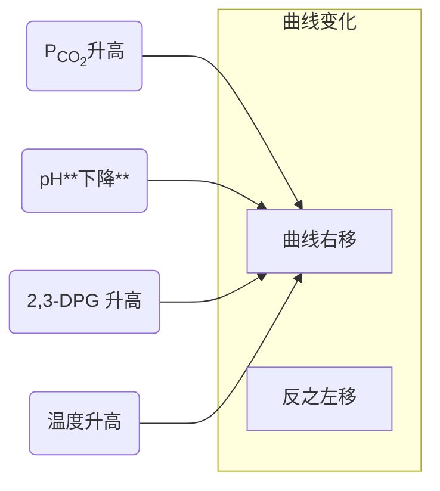
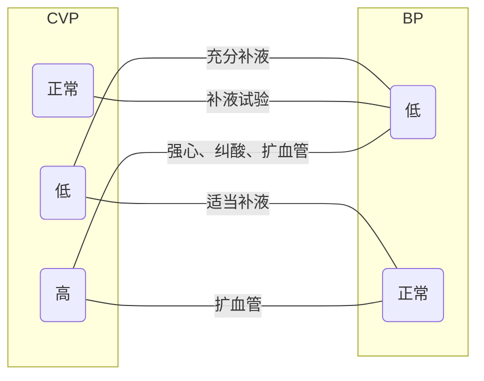

# 第五章 外科休克

## 氧解离曲线

## 休克

休克的根本原因是**有效循环血量下降，组织灌注不足**。

休克好转：尿量>**30ml/h**。

### 休克分期

| 休克分期     | 血管状态                                       | 总结     |
| ------------ | ---------------------------------------------- | -------- |
| 微循环收缩期 | 外周及内脏小动脉收缩（**阻力增加**），重要器官舒张 | 只出不进 |
| 微循环扩张期 | 动静脉**短路**，微循环只进不出                     | 只进不出 |
| 微循环衰竭期 | 高凝状态                                       | DIC      |

### 休克分级

| 休克分级   | 轻   | 中       | 重    | 补充              |
| ---------- | ---- | -------- | ----- | ----------------- |
| 休克指数   | >1   | >1.5     | >2    | = **脉率**/收缩压 |
| 失血量(mL) | <800 | 800~1600 | >1600 |
| 收缩压     | 正常 | 70~90    | <70   | SBP<90 说明失代偿 |

### 感染性休克

感染性休克分类|暖休克|冷休克
--|--|--
类型|高排低阻|低排高阻
发病率|少见|多见
致病菌|部分革兰（+）引起的早期休克|革兰（-）或革兰（+）晚期休克
血管反应|扩张为主|收缩为主
失液|少见|多见
脉压|>30mmHg|<30mmHg
脉搏|慢，搏动清楚|细速
尿量|>30mL/h|<25mL/h
皮肤温度|温暖、干燥|湿冷、冷汗
皮肤色泽|淡红、潮红|苍白、发绀、花斑样发绀
神志|清醒|躁动、冷漠或嗜睡
毛细血管充盈时间|1~2s|延长

感染性休克手术时机：**短期抗休克治疗后**

### 休克用药

- 过敏性休克首选**肾上腺素**
- 感染性休克首选**去甲肾**
- 心源性休克首选**多巴胺**
- 心源性且心率慢选**多巴酚丁胺**

糖皮质激素冲击应达正常用量的 **10~20** 倍，维持**小于48h**（2 天）

休克使用利尿药会**加重**血容量不足

**酚妥拉明**：alpha 受体阻滞剂，可降低外周血管阻力，改善微循环

## CVP

| CVP  | 说明                                       |
| ---- | ------------------------------------------ |
| 5~10 | 正常值                                     |
| <5   | 血容量不足                                 |
| \>15 | 心功能不全,容量血管过度收缩,肺循环阻力增加 |
| \>20 | 充血性心力衰竭                             |

### CVP 与 BP 的关系及治疗原则

| CVP  | BP   | 治疗原则           |
| ---- | ---- | ------------------ |
| 低   | 低   | 充分补液           |
| 低   | 正常 | 适当补液           |
| 正常 | 低   | 补液试验           |
| 高   | 低   | 强心、纠酸、扩血管 |
| 高   | 正常 | 扩血管             |

> 补液后哪个**无变化**，哪个有问题。  
> 如 CVP 无变化为血容量不足，BP 无变化提示心力衰竭。

## 其他

胸腔术后内出血：每小时引流量**大于100mL**  
进行性血胸：200mL/h，持续 3h

### 术后发热

- 1~2 天：非感染性发热
- 3 天以后：感染性发热
