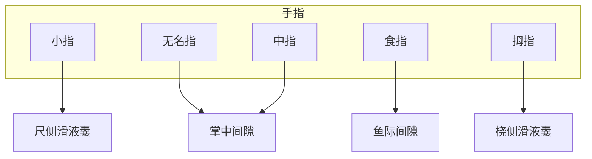

# 第十一章 外科感染

### 细菌性肝脓肿的致病菌

- 大：大肠杆菌
- 伯：肺炎克雷伯菌
- 戴
- 金：金黄色葡萄球菌
- 链：厌氧链球菌
- 很
- 累：类杆菌属

痈好发于**项部及背部**，大多为**金黄色葡萄球菌**感染。

产气性皮下蜂窝织炎多见于**会阴部**。

丹毒的致病菌为**beta-溶血性链球菌**。

体表感染大多为金黄色葡萄球菌。

### 腱鞘炎蔓延地点

### 破伤风

- 特异性临床表现：牙关紧闭、张口困难
- 主要为**外毒素**
- 病人最先受影响的肌群为**咀嚼肌**
- 感染后首先考虑**破伤风免疫球蛋白**
- 破伤风**无侵袭力**，意味着只能透过伤口感染
- 曾经打过类毒素，伤后只需打抗毒素**1500~3000U**

### 气性坏疽

**梭状芽孢杆菌**感染进展迅速，通常24h内发生**气性坏疽**。

气性坏疽未得到控制可出现全身黄染。

预防气性坏疽的关键措施是**尽早彻底清创**。

氨基糖苷类抗生素对气性坏疽无效。

### 革兰染色菌特点

- G+：多为球菌，感染易于局限化；
- G-：多为杆菌，有内毒素，三低（低温，低白细胞，低BP）

### 不同菌种脓液性质

菌种|脓液性质
--|--
溶血性链球菌|稀薄、淡红色、量多、无异味
大肠杆菌|稠厚、粪臭
铜绿假单胞菌|绿色、甜腥臭味
金黄色葡萄球菌|稠厚、黄色、不臭
厌氧菌|恶臭

有感染不能促进血液循环，易致**脓毒血症**。

感染应用糖皮质激素原则：早期、大量、短期（**10~20倍，小于48h**）

联合应用抗菌药物易致**二重感染**（主要为真菌）
