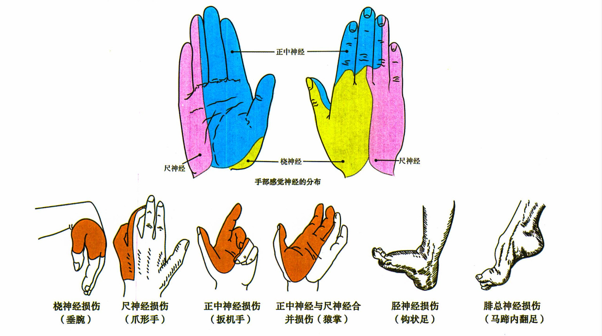

# 第六十四章 周围神经损伤

### 上肢骨折所致神经损伤

- 静夜（肱骨外科颈骨折：腋神经）
- 干扰（肱骨干骨折：桡神经）
- 毕加索（锁骨骨折：臂丛神经）

尺神经损伤：froment试验（ok手势）+，夹纸试验+，爪形手

froment试验+：也叫spinner征。是尺神经损伤的表现，为拇指、示指远侧指间关节不能屈曲，使两者不能捏成一个圆形的"O"型。即食指用力与拇指对指时，呈现食指近侧指间关节明显屈曲、远侧指间关节过伸及拇指掌指关节过伸、指间关节屈曲。

> 看了几个评论，没说到点上，桡神经分为感觉支和运动支，运动支主要在前臂上段和上臂中下段，感觉支在腕部附近，腕部损伤，那肯定是损伤的感觉支😄

腓总神经损伤：足背伸障碍，小腿前外侧及足背前、内侧感觉障碍

> 记住，只考腓总神经。

> 腋不外展，尺不夹纸，桡不抬腕

### 桡神经损伤部位及症状

- 深支～手指运动受损
- 浅支～虎口区感觉受损
- 主干～垂腕

腕管综合征：腕管内压力升高使正中神经受到压迫而产生的症状或体征，女性多见，有夜间痛（休息痛）。

正中神经损伤：猿手（拇指不能对掌）
